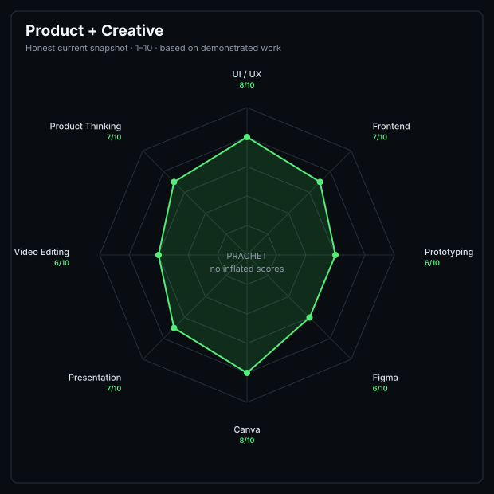
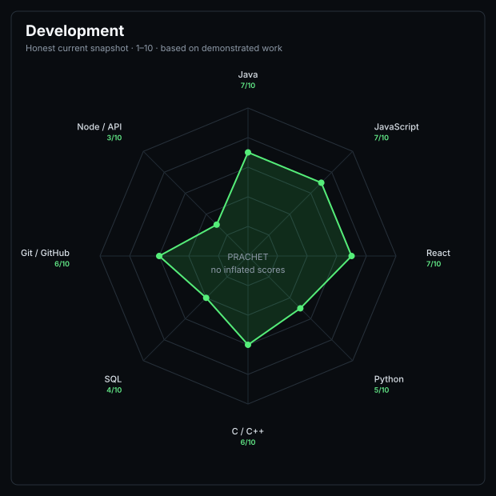

  

  CSE Student • Developer • AI & Data Enthusiast

---
About me</h2>

Hi, I’m Prachet — a CSE student focused on AI & Data Science, a developer, and a badminton player.

I enjoy turning ideas into practical digital products, especially where technology, AI, and thoughtful UI/UX come together. I work with technologies like Java, C/C++, Python, JavaScript, React, and SQL, and I’m constantly exploring new ways to build better systems and experiences.

Beyond coding, I’m passionate about badminton, which has taught me discipline, consistency, and the importance of continuous improvement.

I like working on projects that go beyond simply “making something work” — I care about how it works, how it looks, and how people experience it.

Currently: Learning, building, experimenting, and turning ideas into real projects. 🚀

  
🛠️ Tech Stack<h2>

<table>
<tr>

<td width="50%" align="center" valign="middle">

</td>

<td width="50%" align="center" valign="middle">

</td>

</tr>
</table>

Tools</h2>

🤝 Connect With Me&nbsp;&nbsp;

## 📊 GitHub Stats

<h3>📈 Contribution Graph</h3>

